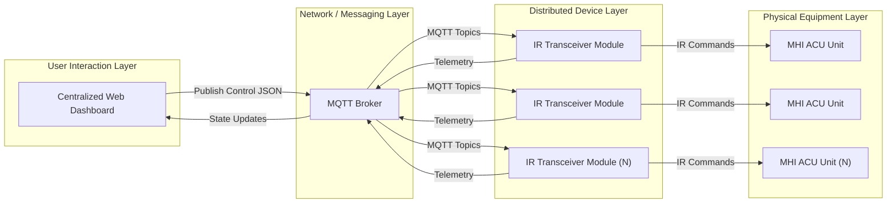
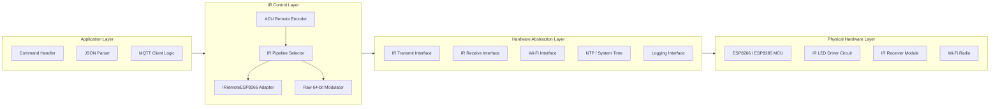
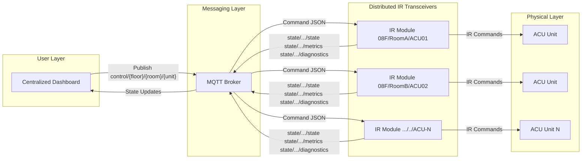
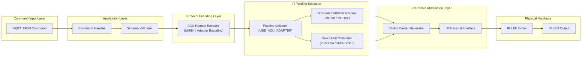

# IR Transceiver Module

<p align="center">
  
  
  
  
</p>

<p align="center">
  ESP01M-based IR transceiver firmware that accepts MQTT JSON commands to control Mitsubishi Heavy AC units.
</p>

<p align="center">
  <strong>Status:</strong> Prototype / Lab-Tested &nbsp;|&nbsp;
  <strong>Primary Target:</strong> Mitsubishi Heavy FDE71VNXVG
</p>

> This firmware exposes MQTT JSON control endpoints and publishes device telemetry for centralized ACU control.

**Quick Facts**
| Category | Details |
| --- | --- |
| MCU | ESP8266 / ESP8285 based ESP01M IR Module |
| Control | MQTT JSON commands |
| IR | Raw 64-bit or IRremoteESP8266 adapters |
| Telemetry | `identity`, `deployment`, `diagnostics`, `metrics`, `error` |
| Time Sync | NTP (UTC+8) |

## Table of Contents
- [Overview](#overview)
- [System Architecture](#system-architecture)
- [Firmware Architecture](#firmware-architecture)
- [Features](#features)
- [Validated Hardware Configuration](#validated-hardware-configuration)
- [Minimum Hardware Requirements](#minimum-hardware-requirements)
- [Getting Started](#getting-started)
- [Configuration](#configuration)
- [MQTT Architecture](#mqtt-architecture)
- [MQTT Usage](#mqtt-usage)
- [IR Processing Pipeline](#ir-processing-pipeline)
- [Protocol Notes](#protocol-notes)
- [Security Notes](#security-notes)
- [Troubleshooting](#troubleshooting)
- [Project Context](#project-context)
- [Author](#author)
- [License](#license)
- [Third-Party Notices](#third-party-notices)

---

## Overview
Distributed IR transceiver firmware enabling centralized ACU control via MQTT and JSON messaging.

Each device acts as an independently addressable IR endpoint within a hierarchical building control architecture.

## System Architecture


## Firmware Architecture
High-level firmware structure showing how application logic routes through IR, networking, and hardware abstractions.



Layer roles:
- Application layer: MQTT handling, JSON parsing, and orchestration
- IR control layer: protocol encoding and pipeline selection
- Hardware abstraction layer: IR transmit, Wi-Fi, time sync, and logging interfaces
- Physical hardware layer: ESP MCU, IR LED driver, and radio subsystem

---

## Features
- MQTT-controlled wireless IR transmission
- JSON payloads for power, mode, fan speed, temperature, and louver position
- Auto-connect to campus Wi-Fi using a pre-filled SSID table with EEPROM caching
- Two IR pipelines: raw 64-bit modulator or IRremoteESP8266 adapters (MHI88/MHI152)
- Telemetry topics for identity, deployment, diagnostics, metrics, and error context
- OTA updates: not enabled (planned)

---

## Validated Hardware Configuration
- ESP01M IR Transceiver Module (ESP8285/ESP8266-based)
- Widely sold as a prebuilt module by online retailers (e.g., Lazada, Shopee, AliExpress)
- Typical sourcing is from Shenzhen; module branding varies

## Minimum Hardware Requirements
- ESP8266 / ESP8285 MCU
- IR LED + transistor driver (38 kHz capable)

---

## Getting Started
### Prerequisites
- VS Code + PlatformIO
- MQTT broker (local Mosquitto or a dev broker)

### Build & Flash
1. Open the repo in VS Code.
2. Install the PlatformIO extension.
3. Select the target environment in `platformio.ini`.
4. Build and upload:
   ```bash
   pio run
   pio run -t upload
   ```

## Configuration

### Secrets File
Create `include/secrets.h` from the template:
- Copy `include/secrets_template.h` to `include/secrets.h`
- Edit the values in `include/secrets.h`
  
### Build-Time IR Pipeline Selection
Set `USE_ACU_ADAPTER` in `include/secrets.h`:
- `1` = use IRremoteESP8266 adapters (MHI88/MHI152)
- `0` = use raw IR modulator (evidently based on PJA502A704AA remote)

The reported identity model string is `ACU_REMOTE_MODEL`.

### Wi-Fi
The Wi-Fi manager supports two connection paths:
- **Single hidden SSID** (direct connect): define `HIDDEN_SSID` and `HIDDEN_PASS` in `include/secrets.h`.
- **Multiple known SSIDs** (scan + pick strongest): provide a credential table in `lib/WiFi_Manager/wifi_credentials.cpp`.

For the scan-based path, create `lib/WiFi_Manager/wifi_credentials.cpp` from the template in `lib/WiFi_Manager/examples/wifi_credentials_template.cpp` and fill in your SSIDs and passwords.

**This file is gitignored in most setups; do not commit secrets.**  

### MQTT Broker Settings
Define broker settings in `include/secrets.h`:
- `MQTT_SERVER`
- `MQTT_PORT`
- `MQTT_USER`
- `MQTT_PASS`

### Topic Roots
Define topic roots in `include/secrets.h`:
- `STATE_PATH` (publish root)
- `CONTROL_PATH` (subscribe root)

### Per-Module Identity
Define module identity in `include/secrets.h`:
- `DEFINED_FLOOR`
- `DEFINED_ROOM`
- `DEFINED_UNIT`
- `DEFINED_ROOM_TYPE_ID`
- `DEFINED_DEPARTMENT`

### NTP
Define NTP servers in `include/secrets.h`:
- `NTP_SERVER_1`
- `NTP_SERVER_2`

Time sync is fixed to  UTC+8 in `lib/NTP/NTP.cpp`.

### Build Flags (Logging)
Define logging flags in `platformio.ini` or `platformio.override.ini` under `build_flags`.

| Flag | Purpose | Default |
| --- | --- | --- |
| `-DLOG_SERIAL_ENABLE=0` | Enable/disable Serial logging output (`0`/`1`) | `1` |
| `-DLOG_LEVEL=3` | Logging verbosity (`0`=Error, `1`=Warn, `2`=Info, `3`=Debug) | `2` |
| `-DLOG_MQTT_ERROR_CONTEXT_MIN_LOG_LEVEL=3` | MQTT `/error` publishing threshold (`0`-`3`, `255`=off) | `3` |

Publishing is enabled when `LOG_LEVEL >= LOG_MQTT_ERROR_CONTEXT_MIN_LOG_LEVEL`.

### Wiring / Pinout
This project assumes the prebuilt ESP01M IR transceiver module. If you are using a bare ESP8285/ESP8266 and discrete IR hardware, you will need to adapt the IR LED driver and receiver wiring accordingly.

---

## MQTT Architecture


## MQTT Usage
### Subscribe Topic (Commands)
The device subscribes to:
```
CONTROL_PATH/DEFINED_FLOOR/DEFINED_ROOM/DEFINED_UNIT
```

### Publish Topics (State and Telemetry)
The device publishes to:
```
STATE_PATH/DEFINED_FLOOR/DEFINED_ROOM/DEFINED_UNIT/state
STATE_PATH/DEFINED_FLOOR/DEFINED_ROOM/DEFINED_UNIT/identity
STATE_PATH/DEFINED_FLOOR/DEFINED_ROOM/DEFINED_UNIT/deployment
STATE_PATH/DEFINED_FLOOR/DEFINED_ROOM/DEFINED_UNIT/diagnostics
STATE_PATH/DEFINED_FLOOR/DEFINED_ROOM/DEFINED_UNIT/metrics
STATE_PATH/DEFINED_FLOOR/DEFINED_ROOM/DEFINED_UNIT/error
```

### JSON Payload Schema
The command handler accepts either a top-level state or a nested `state` object.

Top-level:
```json
{
  "mode": "cool",
  "fan_speed": 2,
  "temperature": 24,
  "louver": 3,
  "power": true
}
```

Nested:
```json
{
  "state": {
    "mode": "cool",
    "fan_speed": 2,
    "temperature": 24,
    "louver": 3,
    "power": true
  }
}
```

### Tight Schema (Validated by Firmware)
> [!NOTE]
> These fields **all** must be present per payload:
- `fan_speed`: integer (uint8)
- `temperature`: integer (uint8)
- `mode`: string
- `louver`: integer (uint8)
- `power`: boolean

Accepted values for IR encoding:
- `mode`: `auto | cool | heat | dry | fan`
- `fan_speed`: `1..6`
- `temperature`: `18..30`
- `louver`: `0..4`
- `power`: `true | false`

Notes:
- Missing required fields cause the command to be rejected.
- Out-of-range values are accepted but encoded to protocol defaults (e.g., unknown temperatures or louver positions map to the encoder defaults).

### Example Publish (mosquitto_pub)
```bash
mosquitto_pub -t control_path/floor_id/room_id/acu_id -m '{
  "mode": "cool",
  "fan_speed": 2,
  "temperature": 24,
  "louver": 3,
  "power": true
}'
```

### Telemetry Fields (Summary)
- `identity`: `device_id`, `mac_address`, `acu_remote_model`, `room_type_id`, `department`
- `deployment`: `ip_address`, `version_hash`, `build_timestamp`, `reset_reason`
- `diagnostics`: `status`, `last_seen_ts`, `last_cmd_ts`, `wifi_rssi`, `free_heap`
- `metrics`: uptime counters, connection stats, command failure counts, heap stats, MQTT publish failures
- `error`: error context snapshots when enabled by logging thresholds

### MQTT Errors and Return Codes
When an MQTT connection attempt fails, the firmware logs an `rc` value. This `rc` is the return code from `PubSubClient::state()` and is defined by the PubSubClient library (see `PubSubClient.h` in that library).

Return codes:
- `-4`: `MQTT_CONNECTION_TIMEOUT`
- `-3`: `MQTT_CONNECTION_LOST`
- `-2`: `MQTT_CONNECT_FAILED`
- `-1`: `MQTT_DISCONNECTED`
- `0`: `MQTT_CONNECTED`
- `1`: `MQTT_CONNECT_BAD_PROTOCOL`
- `2`: `MQTT_CONNECT_BAD_CLIENT_ID`
- `3`: `MQTT_CONNECT_UNAVAILABLE`
- `4`: `MQTT_CONNECT_BAD_CREDENTIALS`
- `5`: `MQTT_CONNECT_UNAUTHORIZED`

In this firmware, the `rc` value is emitted in `reconnectMQTT()` in `lib/MQTT/mqtt_connection.cpp`.

---

## IR Processing Pipeline


---

## Protocol Notes
- Target ACU: Mitsubishi Heavy FDE71VNXVG
- Reverse engineered from mobile app IR encoding
- Evidently based on PJA502A704AA reference remote
- Planned RCN-E-E3 remote support

## Security Notes
- Anonymous MQTT allowed for local testing
- Never expose anonymous brokers publicly
- IR requires line-of-sight
> [!CAUTION]
> TLS/SSL support is not implemented in this repository; secure transport must be provided by your broker/network setup

---

## Troubleshooting
- No IR response: verify line-of-sight and module orientation
- MQTT not connecting: check broker address and port in `include/secrets.h`
- Device not joining Wi-Fi: confirm SSID table contents and credentials or define `HIDDEN_SSID` and `HIDDEN_PASS`

### Boot/Reset Notes (ESP8266)
`boot mode:(1,7)` indicates UART download mode (GPIO0 low at reset). This can be caused by USB-serial auto-reset lines or weak pull-ups on GPIO0/GPIO2. When `LOG_SERIAL_ENABLE=0`, `setup()` skips `Serial.begin()` and the startup delay, which can change boot timing and make strap/auto-reset timing issues more visible.

#### Recommendations
- Consider disabling serial auto-reset during monitor use by setting `monitor_rts=0` and `monitor_dtr=0` (see in `platformio.ini`)
- Ensure proper pull-ups on GPIO0/GPIO2 for ESP-01/ESP-01M modules
- If changing `build_flags`, do a clean rebuild (`pio run -t clean`) to avoid stale flag state

---

## Project Context
This project aims to develop the IR remote module to be deployed on each air conditioning unit (ACU) in various rooms. Accompanying the hardware is a centralized dashboard to control and monitor each transceiver.

Part of the Centralized ACU Project under the Building Energy Management initiative at Asia Pacific College - School of Engineering (APC-SoE), Academic Year 2024–2026.

## Author
Keanu Geronimo  
- GitHub: [@Xrnah](https://github.com/Xrnah)  
- LinkedIn: [Keanu Geronimo](https://www.linkedin.com/in/keanu-geronimo-a77062190/)  
- Portfolio: [Canva - PROFETH Portfolio](https://geronimo-keanu-portfolio.my.canva.site/)  

## License
MIT License. See `LICENSE`.

## Third-Party Notices
See `THIRD_PARTY_NOTICES.md`.
